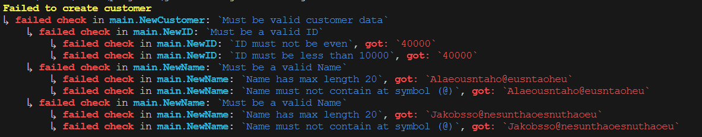

# go-checks
Go validation &amp; error handling for the modern man

## How to install

```
go get github.com/quotidian-dumbass-brigade/go-checks
```

## How to use

```go
package main

import (
	"fmt"
	"os"
	"strings"

	"github.com/quotidian-dumbass-brigade/go-checks"
)

type ID uint

func NewID(value uint) (ID, *checks.Check) {
	MustBeValidID := checks.New("Must be a valid ID")
	MustNotBeZero := checks.New("ID must not be 0")
	MustNotBeEven := checks.New("ID must not be even")
	MustBeLessThanTenThousand := checks.New("ID must be less than 10000")

	if value == 0 {
		MustBeValidID.FailBy(MustNotBeZero.Fail(value))
	}

	if value%2 == 0 {
		MustBeValidID.FailBy(MustNotBeEven.Fail(value))
	}

	if value > 10000 {
		MustBeValidID.FailBy(MustBeLessThanTenThousand.Fail(value))
	}

	if MustBeValidID.Failed {
		return 0, MustBeValidID
	}

	return ID(value), checks.Pass()
}

type Name string

func NewName(value string) (Name, *checks.Check) {
	MustBeValidName := checks.New("Must be a valid Name")
	MustHaveMaxLength20 := checks.New("Name has max length 20")
	MustNotContainAtSymbol := checks.New("Name must not contain at symbol (@)")

	if len(value) > 20 {
		MustBeValidName.FailBy(MustHaveMaxLength20.Fail(value))
	}

	if strings.Contains(value, "@") {
		MustBeValidName.FailBy(MustNotContainAtSymbol.Fail(value))
	}

	if MustBeValidName.Failed {
		return "", MustBeValidName
	}

	return Name(value), checks.Pass()
}

type Customer struct {
	ID        ID
	FirstName Name
	LastName  Name
}

func NewCustomer(id uint, firstName, lastName string) (*Customer, *checks.Check) {
	checkCustomerData := checks.New("Must be valid customer data")

	ID, checkID := NewID(id)
	if checkID.Failed {
		checkCustomerData.FailBy(checkID)
	}

	FirstName, checkName := NewName(firstName)
	if checkName.Failed {
		checkCustomerData.FailBy(checkName)
	}

	LastName, checkName := NewName(lastName)
	if checkName.Failed {
		checkCustomerData.FailBy(checkName)
	}

	if checkCustomerData.Failed {
		return &Customer{}, checkCustomerData
	}

	return &Customer{ID, FirstName, LastName}, checks.Pass()
}

func main() {
	customer, checkCustomer := NewCustomer(40000, "Alaeousntaho@eusntaoheu", "Jakobsso@nesunthaoesnuthaoeu")
	if checkCustomer.Failed {
		checkCustomer.Blame("Failed to create customer")
		os.Exit(1)
	}

	fmt.Println("Customer created: ", *customer)
}
```

This will print an error message that looks like this:



Very cool, everybody loves it.